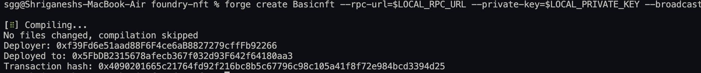
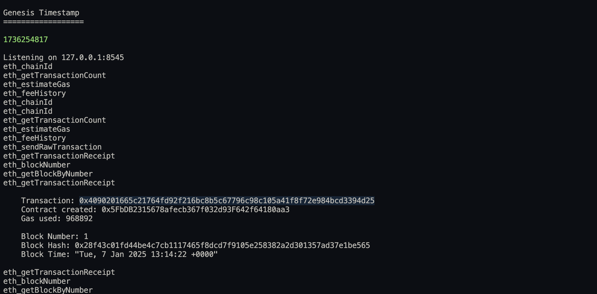

# Project Description

This project is a collection of smart contracts developed using Foundry, focusing on creating and managing NFTs (Non-Fungible Tokens). The primary contracts include `MoodNft`, which allows users to mint NFTs with mood-based images, and `BasicNft`, which provides a standard NFT minting functionality. The project showcases the capabilities of Foundry for Ethereum application development and emphasizes best practices in smart contract development.

# Course Information

This project is developed as part of the Cryfrin Updraft's Advanced Foundry course, which aims to provide in-depth knowledge and practical experience in Ethereum development using the Foundry toolkit.

## Foundry

**Foundry is a blazing fast, portable and modular toolkit for Ethereum application development written in Rust.**

Foundry consists of:

- **Forge**: Ethereum testing framework (like Truffle, Hardhat and DappTools).
- **Cast**: Swiss army knife for interacting with EVM smart contracts, sending transactions and getting chain data.
- **Anvil**: Local Ethereum node, akin to Ganache, Hardhat Network.
- **Chisel**: Fast, utilitarian, and verbose solidity REPL.

## Libraries Used

- **Foundry**: Version: [latest]
- **OpenZeppelin Contracts**: Version: [latest]
- **Forge-Std**: Version: [latest]

## Installation

To set up the project, ensure you have Foundry installed. You can install it by following the instructions in the [Foundry documentation](https://book.getfoundry.sh/).

After installing Foundry, clone this repository and navigate to the project directory:

```bash
git clone <repository-url>
cd foundry-nft
```

## Usage

To interact with the smart contracts, you can use the following functions:

- **MoodNft**
  - `mintNft()`: Mints a new NFT with the mood images.
  - `tokenURI(uint256 tokenId)`: Returns the token URI for a given token ID.

- **BasicNft**
  - `mintNft(string memory _tokenURI)`: Mints a new NFT with a specified token URI.
  - `tokenURI(uint256 tokenId)`: Returns the token URI associated with a given token ID.

## Contract Descriptions

### MoodNft

- **State Variables**:
  - `s_tokenCounter`: Counter for minted tokens.
  - `s_sadSvg`: URI for the sad SVG image.
  - `s_happySvg`: URI for the happy SVG image.

- **Functions**:
  - `constructor(string memory sadSvgImageUri, string memory happySvgImageUri)`: Initializes the contract with SVG image URIs.
  - `mintNft()`: Mints a new NFT.
  - `tokenURI(uint256 tokenId)`: Returns the token URI (not implemented).

### BasicNft

- **State Variables**:
  - `s_tokenCounter`: Counter for minted tokens.
  - `s_tokenIdToUri`: Mapping of token IDs to URIs.

- **Functions**:
  - `constructor()`: Initializes the contract with name "Catyo" and symbol "CAT".
  - `mintNft(string memory _tokenURI)`: Mints a new NFT with a specified token URI.
  - `tokenURI(uint256 tokenId)`: Returns the token URI for a given token ID.

## Testing

To run tests for the contracts, use the following command:

```bash
forge test
```

## Contributing

Contributions are welcome! Please submit a pull request or open an issue for any suggestions or improvements.

## License

This project is licensed under the MIT License.




> ❗ **IMPORTANT**
> Add `fs_permissions = [{ access = "read", path = "./broadcast" }]` to your `foundry.toml` or DevOpsTools won't have the permissions necessary to function correctly! This is more safe than `FFI=true`.
